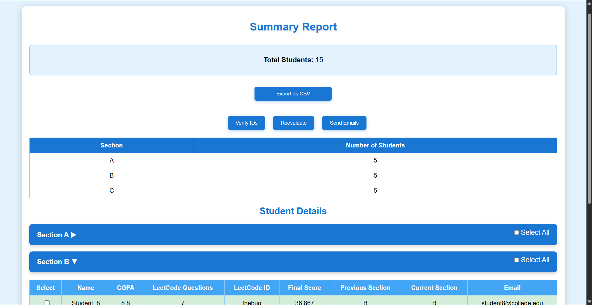
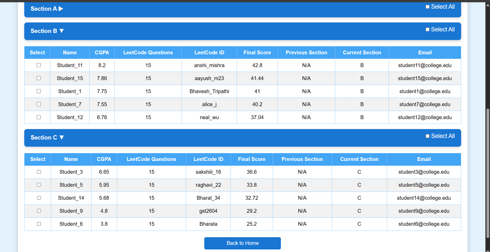

# Dynamic Student Grouping System

A professional web application for automated, data-driven student section allocation and notification, developed as a 4th Semester Project at Graphic Era Hill University.

---

## Screenshots

### 1. Summary Report & Actions


### 2. Section-wise Student Allocation



---

## Features

- **Automated Section Allocation:**  
  Assigns students to sections (A, B, C, ...) based on CGPA and LeetCode performance using a fair, block-based algorithm.

- **LeetCode ID Verification:**  
  Verifies the number of LeetCode questions solved by each student via the LeetCode API.

- **Bulk Email Notification:**  
  Sends personalized, professional emails to students with their updated section, CGPA, LeetCode stats, and final score.

- **CSV Upload & Export:**  
  Upload student data in CSV format and export processed results.

- **Modern UI:**  
  Built with React and Vite for a fast, responsive user experience.

---

## Tech Stack

- **Frontend:** React, Vite, Axios, CSS
- **Backend:** Flask, Flask-Mail, Flask-CORS, Pandas, Requests
- **Other:** LeetCode GraphQL API, Gmail SMTP (App Password)

---

## Setup Instructions

### 1. Clone the Repository

```bash
git clone https://github.com/yourusername/dynamic-student-grouping.git
cd dynamic-student-grouping
```